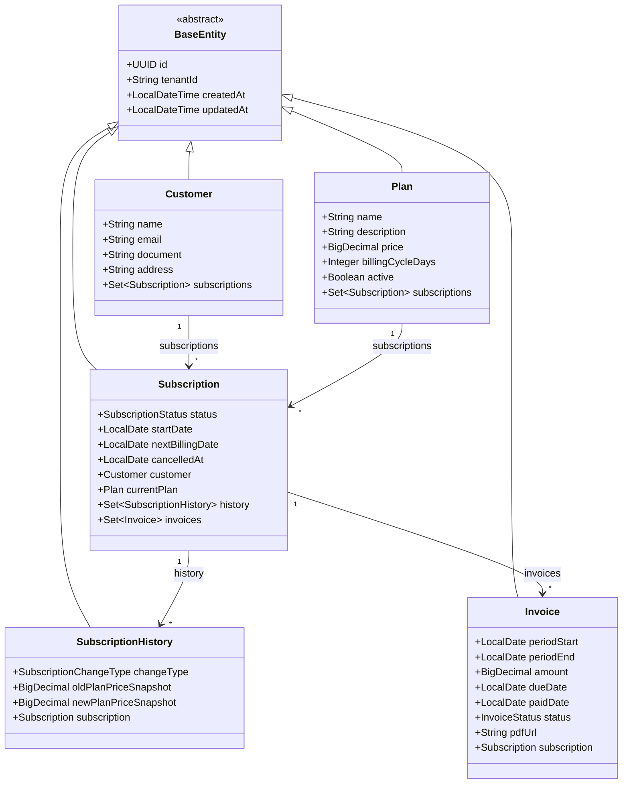

# SaaS Billing Engine (Motor de Cobrança Recorrente Multi-Tenant)

> API e Engine de Faturamento Recorrente Multi-Tenant de Alta Performance, focada em isolamento contextual de dados, cálculo pró-rata e auditoria financeira imutável.

<div align="center">
  
  
  
</div>

---

## 💻 Sobre o Projeto

O **SaaS Billing Engine** é uma solução backend robusta desenvolvida com **Spring Boot 4** e **Java 21**, projetada para simular e operar o núcleo de faturamento recorrente (subscription billing) de sistemas SaaS de escala enterprise.

Este projeto vai além do gerenciamento simples de assinaturas. Ele implementa regras financeiras e contábeis rigorosas:
* **Isolamento de Dados Multi-tenant:** Separação transparente por tenant na camada de dados aproveitando recursos nativos do Hibernate 6 (`@TenantId`).
* **Cobranças Recorrentes Idempotentes:** Automatização agendada via Spring Scheduler que garante execução única e resiliência contra duplicidades mesmo em cenários de falhas parciais ou reprocessamento.
* **Blindagem de Auditoria Financeira:** Snapshots de valores em `BigDecimal` com cálculo de pró-rata preciso, imunes a futuras alterações de preço dos planos.

## 🚀 Funcionalidades e Regras de Negócio

| Funcionalidade | Status | Detalhes Técnicos e Regras de Negócio |
|:---|:---:|:---|
| **Isolamento Multi-tenant** | ✅ | Utilização do recurso `@TenantId` do Hibernate 6 estendendo `BaseEntity`. Filtro contextual HTTP (`X-Tenant-ID`) via `TenantFilter` e `TenantContext` em ThreadLocal. |
| **Cobranças Idempotentes** | ✅ | Job automatizado via `BillingScheduler` (`@Scheduled`). Idempotência garantida via restrição única composta no banco (`tenant_id`, `subscription_id`, `period_start`, `period_end`) tratando `DataIntegrityViolationException`. |
| **Cálculo Pró-rata e Snapshots** | ✅ | Cálculo exato de valor proporcional por dias com `BigDecimal` (`RoundingMode.HALF_UP`). O valor final da fatura (`amount`) fica congelado na entidade `Invoice`. |
| **Gestão de Planos** | ✅ | Suporte a planos com ciclo de cobrança dinâmico (`billingCycleDays`), valores em `BigDecimal` e controle de ativação (`active`). |
| **Assinaturas Recorrentes** | ✅ | Controle de ciclo de vida da assinatura (`PENDING`, `ACTIVE`, `CANCELLED`), controle da próxima data de fatura e relacionamento direto com cliente e plano. |
| **Histórico de Assinatura** | ✅ | Entidade `SubscriptionHistory` anotada com `@Immutable` para registro auditável de alterações e trocas de plano com snapshots de preços antigos e novos. |

## 🛠 Arquitetura e Tecnologias

A aplicação segue uma arquitetura em camadas modularizada por domínio (*Domain-Driven / Package-by-Feature*), garantindo alto desacoplamento e fácil manutenção.

* **Linguagem:** Java 21
* **Framework:** Spring Boot 4.0.2
* **Dados:** Spring Data JPA (Hibernate 6)
* **Banco de Dados:** PostgreSQL
* **Utilitários:** Lombok, DTO Pattern
* **Documentação:** OpenAPI (Swagger UI)

### Destaques de Código

* **Multi-Tenancy Nativo:** Modelo estendido de `BaseEntity` contendo `@TenantId`, garantindo que todas as tabelas e consultas respeitem automaticamente o tenant context atual.
* **Garantia de Idempotência:** Processamento em lote em janela segura de transação (`REQUIRES_NEW`), onde falhas em uma fatura individual não afetam a execução global do batch.
* **Auditoria Financeira:** Uso exclusivo de `BigDecimal` com precisão e escala explícitas em todas as operações monetárias.

## 📊 Diagrama de Domínio

Abaixo está o diagrama de classes que ilustra os relacionamentos e entidades do domínio:



## 📦 Estrutura de Pacotes

A organização do código é dividida por módulos de domínio:

```plaintext
com.juliana_barreto.saas_billing_engine
├── modules
│   ├── customer        # Entidades, DTOs e Repositórios de Clientes
│   ├── invoice         # Regras de Faturamento, Invoices, Services e Scheduler
│   ├── plan            # Gestão de Planos de Assinatura
│   └── subscription    # Gestão de Assinaturas, Status e Histórico Auditável
├── shared
│   └── infra
│       └── multitenancy # TenantContext, TenantFilter e TenantIdentifierResolver
└── BillingEngineApplication.java
```

## ▶️ Como Executar

### Pré-requisitos

- Java 21
- Maven 3.8+
- PostgreSQL

### Passo a Passo

1. **Clone o repositório:**

```bash
git clone https://github.com/juliana-barreto/saas-billing-engine.git
cd saas-billing-engine
```

2. **Configure as Variáveis de Ambiente:**

Defina a senha do seu banco de dados PostgreSQL antes de executar:

* **Linux/macOS:** `export DB_PASSWORD=sua_senha_local`
* **Windows (CMD):** `set DB_PASSWORD=sua_senha_local`
* **Windows (PowerShell):** `$env:DB_PASSWORD="sua_senha_local"`

3. **Execute a aplicação:**

```bash
./mvnw spring-boot:run
```

4. **Acesse a Documentação (Swagger UI):**

Abra o navegador em: [http://localhost:8080/swagger-ui.html](http://localhost:8080/swagger-ui.html)

---

<div align="center"> Desenvolvido com ☕ e Spring Boot por <strong>Juliana Barreto</strong>. </div>
